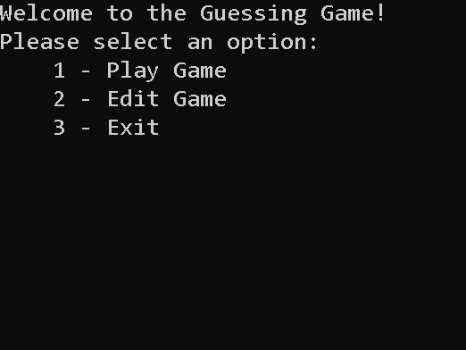
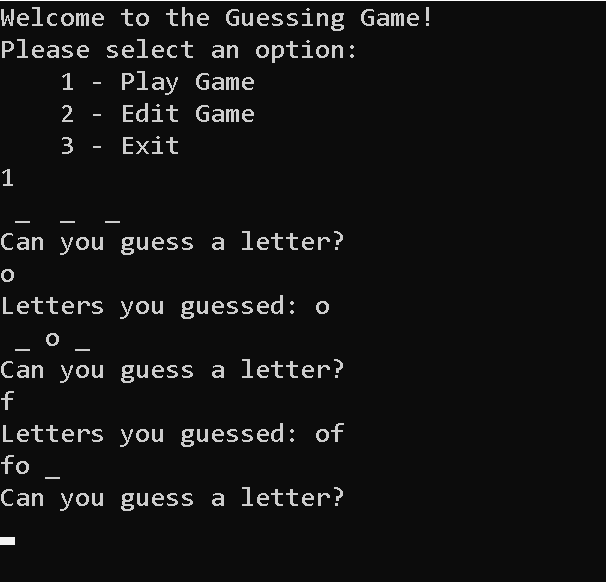
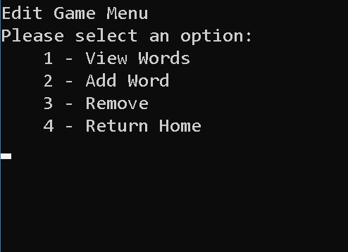

## Word Guess Game

Create a console application that is a word guessing game. The hidden word is randomly selected from an external text file. The user will see which letters he/she has guessed, the correct letters displayed in the word, and the ability to add/remove words from the external text file.

# Load Application
1.	in terminal: git clone https://github.com/mtncrawler/lab03-wordGuessGame.git
2.	open lab03-wordGuessGame.sln
3.	run application without debugging
4.	enjoy the game!